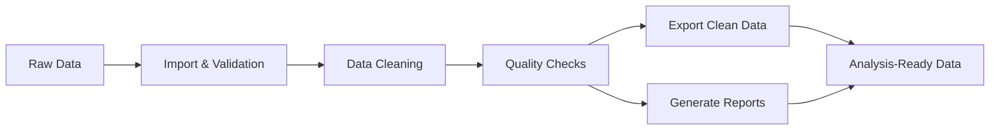

# Clinical Data Cleaning Pipeline


- **Automated outlier detection** using statistical methods
- **Variable name standardization** for consistency
- **Data type conversion** and proper formatting
- **Missing value handling** with configurable imputation strategies
- **Text data normalization** (case standardization, whitespace removal)
- **Data harmonization** across multiple sources
### ✅ Quality Control
- **Comprehensive quality reports** with visual summaries
- **Statistical descriptions** and distribution analyses
- **Inconsistency detection** across related fields
- **Protocol deviation identification** and flagging
- **Data completeness metrics** tracking
### 📄 Documentation & Compliance
- **Detailed operation logs** for every transformation
- **Complete audit trail** for regulatory compliance
- **Data lineage tracking** from raw to processed data
- **Automated report generation** in HTML/PDF formats
- **Version control** of all processing steps
### Pipeline Workflow

---
## 🚀 Setup and Running Instructions
### Prerequisites
Ensure you have **R version 4.0 or higher** installed on your system. You can download R from [CRAN](https://www.r-project.org/).
### Installation
**Step 1: Clone the repository**
```bash
git clone https://github.com/GiseleMalvezzi/clinical-data-cleaning-pipeline.git
cd clinical-data-cleaning-pipeline
```
**Step 2: Install required R packages**
```r
# Install all required packages
install.packages(c(
  "tidyverse",      # Data manipulation and visualization
  "data.table",     # Fast data processing
  "validate",       # Data validation rules
  "janitor",        # Data cleaning utilities
  "lubridate",      # Date/time handling
  "readxl",         # Excel file import
  "writexl",        # Excel file export
  "yaml",           # Configuration file handling
  "rmarkdown",      # Report generation
  "knitr",          # Document generation
  "assertr",        # Data validation
  "skimr",          # Data summaries
  "naniar",         # Missing data visualization
  "visdat"          # Data visualization
))
```
**Step 3: Configure the pipeline**
Edit the configuration files to match your project requirements:
- `config/config.yaml` - General pipeline parameters
- `config/validation_rules.yaml` - Custom validation rules for your study
