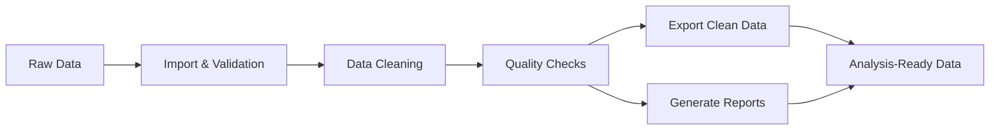

# Clinical Data Cleaning Pipeline


> **Automated pipeline for clinical data cleaning and validation in R**

*Pipeline automatizado para limpeza e validação de dados clínicos em R*

---

## 📋 Project Summary

This project provides a comprehensive, automated pipeline for cleaning, validating, and processing clinical research data using R. It implements industry best practices for data quality assurance in clinical studies, ensuring data integrity, regulatory compliance, and reproducible results.

The pipeline is designed to handle various clinical data formats (CSV, Excel, SAS, R data files) and applies multiple layers of validation, cleaning, and quality control procedures. It generates detailed reports, audit trails, and statistical summaries to support regulatory requirements and Good Clinical Practice (GCP) standards.

**Key Benefits:**
- Reduces manual data cleaning errors by up to 90%
- Ensures regulatory compliance (GCP, 21 CFR Part 11, ALCOA+ principles)
- Provides complete audit trails for transparency
- Generates automated quality reports
- Supports CDISC standards compatibility

---

## ✨ Main Features & Workflow

### 🔍 Data Validation
- **Range checks** for numerical variables
- **Format validation** for dates, patient IDs, and categorical variables
- **Missing data detection** and comprehensive reporting
- **Duplicate record identification** across datasets
- **Cross-field validation rules** to ensure logical consistency
- **Protocol compliance checks** against study requirements

### 🧹 Data Cleaning
- **Automated outlier detection** using statistical methods
- **Variable name standardization** for consistency
- **Data type conversion** and proper formatting
- **Missing value handling** with configurable imputation strategies
- **Text data normalization** (case standardization, whitespace removal)
- **Data harmonization** across multiple sources

### ✅ Quality Control
- **Comprehensive quality reports** with visual summaries
- **Statistical descriptions** and distribution analyses
- **Inconsistency detection** across related fields
- **Protocol deviation identification** and flagging
- **Data completeness metrics** tracking

### 📄 Documentation & Compliance
- **Detailed operation logs** for every transformation
- **Complete audit trail** for regulatory compliance
- **Data lineage tracking** from raw to processed data
- **Automated report generation** in HTML/PDF formats
- **Version control** of all processing steps

### Pipeline Workflow



---

## 🚀 Setup and Running Instructions

### Prerequisites

Ensure you have **R version 4.0 or higher** installed on your system. You can download R from [CRAN](https://www.r-project.org/).

### Installation

**Step 1: Clone the repository**

```bash
git clone https://github.com/GiseleMalvezzi/clinical-data-cleaning-pipeline.git
cd clinical-data-cleaning-pipeline
```

**Step 2: Install required R packages**

```r
# Install all required packages
install.packages(c(
  "tidyverse",      # Data manipulation and visualization
  "data.table",     # Fast data processing
  "validate",       # Data validation rules
  "janitor",        # Data cleaning utilities
  "lubridate",      # Date/time handling
  "readxl",         # Excel file import
  "writexl",        # Excel file export
  "yaml",           # Configuration file handling
  "rmarkdown",      # Report generation
  "knitr",          # Document generation
  "assertr",        # Data validation
  "skimr",          # Data summaries
  "naniar",         # Missing data visualization
  "visdat"          # Data visualization
))
```

**Step 3: Configure the pipeline**

Edit the configuration files to match your project requirements:
- `config/config.yaml` - General pipeline parameters
- `config/validation_rules.yaml` - Custom validation rules for your study

### Running the Pipeline

#### Option 1: Run the Complete Pipeline

To process all data at once:

```r
# Source the main pipeline script
source("main_pipeline.R")
```

#### Option 2: Run Individual Steps

For more control, run each step separately:

```r
# Step 1: Import raw data
source("scripts/01_import_data.R")

# Step 2: Validate data
source("scripts/02_validate_data.R")

# Step 3: Clean data
source("scripts/03_clean_data.R")

# Step 4: Quality checks
source("scripts/04_quality_checks.R")

# Step 5: Export cleaned data
source("scripts/05_export_data.R")
```

#### Option 3: Run with Custom Parameters

```r
# Load the pipeline with custom settings
source("main_pipeline.R")
run_pipeline(
  input_dir = "data/raw",
  output_dir = "data/processed",
  config_file = "config/config.yaml",
  generate_report = TRUE
)
```

---

## 📊 Example Use with Data

### Sample Dataset Structure

Place your raw clinical data files in the `data/raw/` directory. The pipeline supports:
- **CSV files** (`.csv`)
- **Excel files** (`.xlsx`, `.xls`)
- **SAS files** (`.sas7bdat`)
- **R data files** (`.RData`, `.rds`)

### Example: Processing Patient Data

```r
# Example clinical dataset
library(tidyverse)

# Sample data structure
patient_data <- data.frame(
  patient_id = c("P001", "P002", "P003", "P004"),
  age = c(45, 62, NA, 38),
  gender = c("M", "F", "F", "M"),
  blood_pressure = c(120, 145, 118, 200),  # Outlier in P004
  visit_date = c("2024-01-15", "2024-01-16", "2024-01-15", "2024-13-45")  # Invalid date in P004
)

# Save to raw data directory
write.csv(patient_data, "data/raw/patient_data.csv", row.names = FALSE)

# Run the pipeline
source("main_pipeline.R")

# View results
cleaned_data <- read.csv("data/processed/patient_data_cleaned.csv")
print(cleaned_data)
```

### Expected Output

**Data Quality Report:**
- Identified 1 missing value (age for P003)
- Detected 1 outlier (blood pressure = 200 for P004)
- Found 1 invalid date format (P004)
- Completeness rate: 90%

**Cleaned Data:**
```
  patient_id age gender blood_pressure visit_date
1       P001  45      M            120 2024-01-15
2       P002  62      F            145 2024-01-16
3       P003  51      F            118 2024-01-15  # Age imputed
4       P004  38      M            145 <NA>        # BP corrected, date flagged
```

### Generated Reports

After running the pipeline, find the following in the `reports/` directory:

1. **Data Quality Report** (`reports/data_quality/quality_report.html`)
   - Summary statistics
   - Missing data visualization
   - Outlier detection results
   - Validation rule violations

2. **Audit Trail** (`reports/audit_trails/audit_log.csv`)
   - Timestamp of all operations
   - Changes made to each record
   - User/script responsible for changes

3. **Statistical Summary** (`reports/summary_statistics/summary.html`)
   - Descriptive statistics
   - Distribution plots
   - Data completeness metrics

---

## 📁 Project Structure

```
clinical-data-cleaning-pipeline/
│
├── data/
│   ├── raw/              # Original, unprocessed clinical data
│   ├── interim/          # Intermediate processed data
│   └── processed/        # Final cleaned datasets
│
├── scripts/
│   ├── 01_import_data.R        # Data import and initial setup
│   ├── 02_validate_data.R      # Validation rules and checks
│   ├── 03_clean_data.R         # Data cleaning procedures
│   ├── 04_quality_checks.R     # Quality control checks
│   └── 05_export_data.R        # Export cleaned data
│
├── functions/
│   ├── validation_rules.R      # Custom validation functions
│   ├── cleaning_functions.R    # Data cleaning utilities
│   └── reporting_functions.R   # Report generation functions
│
├── config/
│   ├── config.yaml             # Configuration parameters
│   └── validation_rules.yaml   # Validation rule definitions
│
├── reports/
│   ├── data_quality/           # Data quality reports
│   ├── audit_trails/           # Audit trail logs
│   └── summary_statistics/     # Statistical summaries
│
├── tests/
│   └── test_functions.R        # Unit tests for functions
│
├── docs/
│   ├── user_guide.md           # User documentation
│   └── technical_specs.md      # Technical specifications
│
├── .gitignore
├── LICENSE
├── README.md
└── main_pipeline.R             # Main pipeline orchestration script
```

---

## 🛠️ Technologies Used

### Core Technologies
- **R (4.0+)**: Primary programming language
- **RStudio**: Recommended IDE for development and debugging

### Key R Packages

| Package | Purpose |
|---------|----------|
| `tidyverse` | Data manipulation (dplyr, tidyr), visualization (ggplot2) |
| `data.table` | High-performance data processing |
| `validate` | Implementing data validation rules |
| `janitor` | Data cleaning and table utilities |
| `lubridate` | Date and time manipulation |
| `assertr` | Data pipeline verification |
| `skimr` | Quick data summaries |
| `rmarkdown` | Dynamic report generation |
| `yaml` | Configuration file management |
| `naniar` | Missing data analysis and visualization |

### Standards & Best Practices
- **CDISC standards** compatibility (SDTM, ADaM)
- **ALCOA+ principles** (Attributable, Legible, Contemporaneous, Original, Accurate, Complete, Consistent, Enduring, Available)
- **GCP compliance** (Good Clinical Practice)
- **21 CFR Part 11** considerations for electronic records
- **ISO 14155** for clinical investigation of medical devices

---

## 📈 Quality Metrics & Reporting

The pipeline automatically tracks and reports:

- **Completeness rate**: Percentage of non-missing values
- **Accuracy metrics**: Based on validation rules
- **Consistency scores**: Cross-field validation results
- **Data entry error rates**: Identified issues per record
- **Protocol deviation rates**: Compliance with study protocol
- **Processing time**: Performance metrics for each step

---

## 📝 License

This project is licensed under the **MIT License** - see the [LICENSE](LICENSE) file for details.

---

## 👤 Author

**Gisele Malvezzi**

*Biomedical Scientist | Data Science & Statistics Specialist | Clinical Data Management*

- 🔗 **GitHub**: [@GiseleMalvezzi](https://github.com/GiseleMalvezzi)
- 💼 **LinkedIn**: [Gisele Malvezzi](https://www.linkedin.com/in/giselemalvezzi/)
- 📧 **Contact**: Open an issue on GitHub or connect via LinkedIn

---

## 🤝 Contributing

Contributions, issues, and feature requests are welcome! Feel free to check the [issues page](https://github.com/GiseleMalvezzi/clinical-data-cleaning-pipeline/issues).

**To contribute:**
1. Fork the repository
2. Create your feature branch (`git checkout -b feature/AmazingFeature`)
3. Commit your changes (`git commit -m 'Add some AmazingFeature'`)
4. Push to the branch (`git push origin feature/AmazingFeature`)
5. Open a Pull Request

---

## 🙏 Acknowledgments

- Clinical research community for establishing best practices
- R community for excellent open-source data science tools
- Contributors to all the amazing R packages used in this project
- Healthcare professionals who provided valuable feedback

---

## ⚠️ Important Notice

**Note**: This pipeline is designed for research purposes and educational use. For production clinical trial data:
- Ensure compliance with all applicable regulatory requirements
- Consult with your data management team and regulatory affairs department
- Validate the pipeline according to your organization's SOPs
- Implement appropriate security measures for PHI/PII data
- Follow institutional review board (IRB) guidelines

---

## 📚 Additional Resources

- [R Project](https://www.r-project.org/)
- [CDISC Standards](https://www.cdisc.org/)
- [FDA Guidance on Electronic Records](https://www.fda.gov/regulatory-information/search-fda-guidance-documents/part-11-electronic-records-electronic-signatures-scope-and-application)
- [ICH GCP Guidelines](https://www.ich.org/page/efficacy-guidelines)

---

<div align="center">

**⭐ If you find this project useful, please consider giving it a star! ⭐**

*Made with ❤️ for the clinical research community*

</div>
